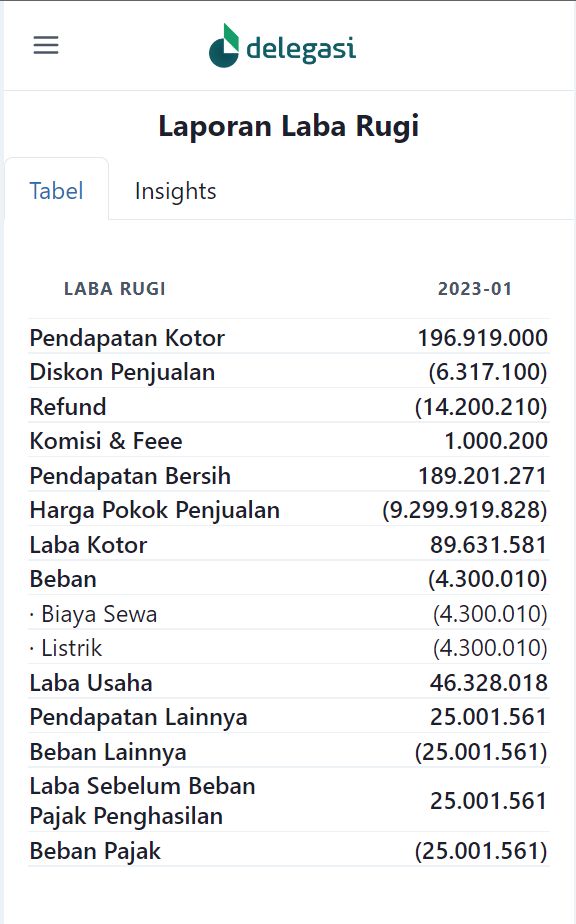
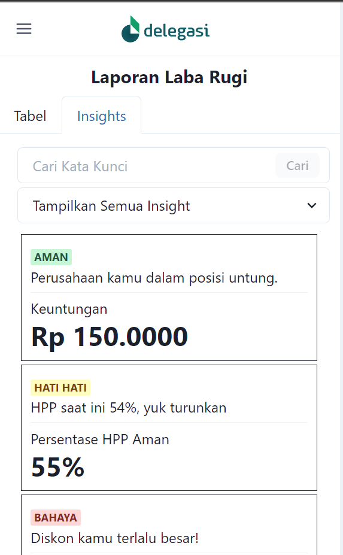
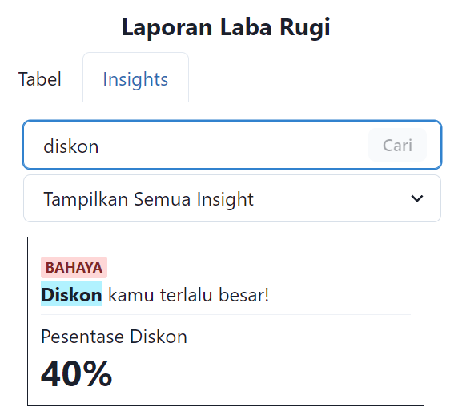
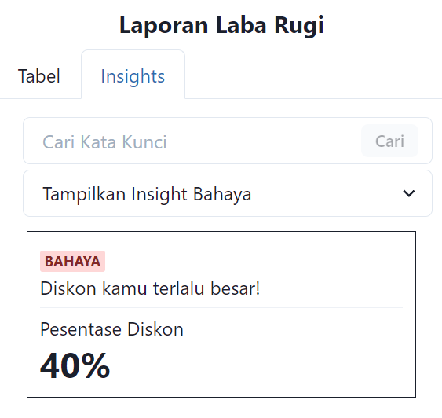

# Beranda

Pada `Beranda`, ini hanya page bridging untuk ke `Laporan Neraca` dan `Laporan Laba Rugi`

---

# Laporan Neraca & Laporan Laba Rugi

Pada `Laporan Neraca` dan `Laporan Laba Rugi` ini saya membuat 2 page yang ditaruh pada tabs.

### Problem:

- user tidak punya keahlian pada accounting
- user ingin tahu hal yang penting dari laporan tersebut

### Solusi:

#### Info Detail Section (Tabel):

Pada section ini berupa tabel seperti laporan keuangan biasa. Ini menjadi acuan customer dalam melihat data.

#### Info Penting Section (Insights):

Pada section ini saya beri nama Insights, berisi hal-hal penting apa saja yang di dapat dari laporan keuangan tersebut. Ekspektasinya customer jika ingin mencari hal-hal tersebut cukup dapat melihat section insight ini, kare ini berupa interpretasi dari tabel/laporan keuangan. Berisi features:

- **Search**, agar user langsung to the point mendapat kan data yang diinginkan. (e.g. ingin tahu kondisi diskon)

- **Filter Bar**, agar user bisa tau kondisi mana saja yang perlu dibenahi.

Tabel dan Insight section dirangkai dalam tab untuk mempersimpel tampilan.

### Challenge:

- Menampilkan tabel pada tampilan mobile ada kesulitan sendiri, karena layarnya tidak lebar tapi harus menampilkan data secara lengkap.
- Membuat sesuatu yang ringkas tapi bermakna memiliki tantangan sendiri, dan tentunya saya sebagai penulis bukan sebagai domain expert juga makin membuat kompleksitas semakin tinggi.
