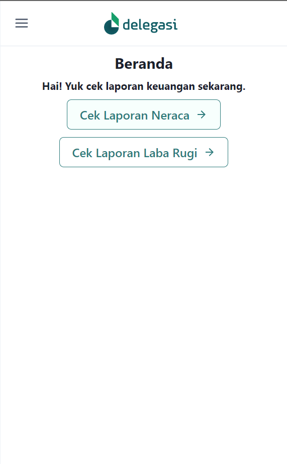
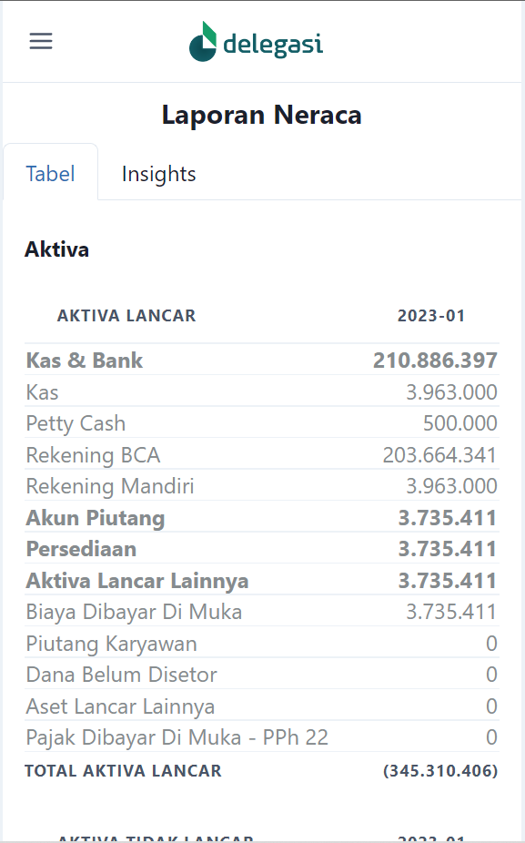
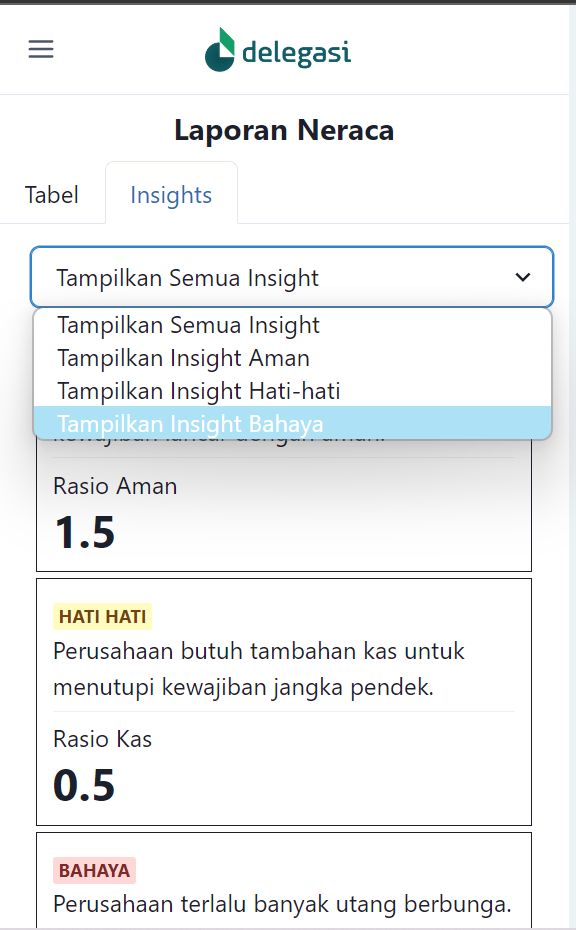
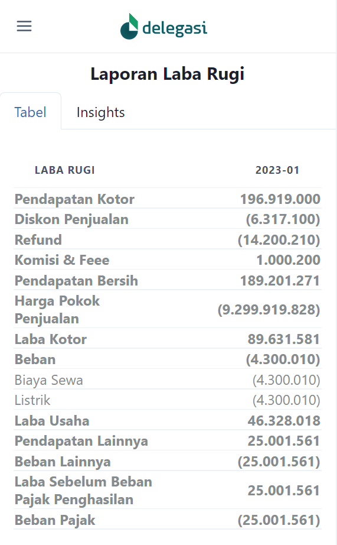
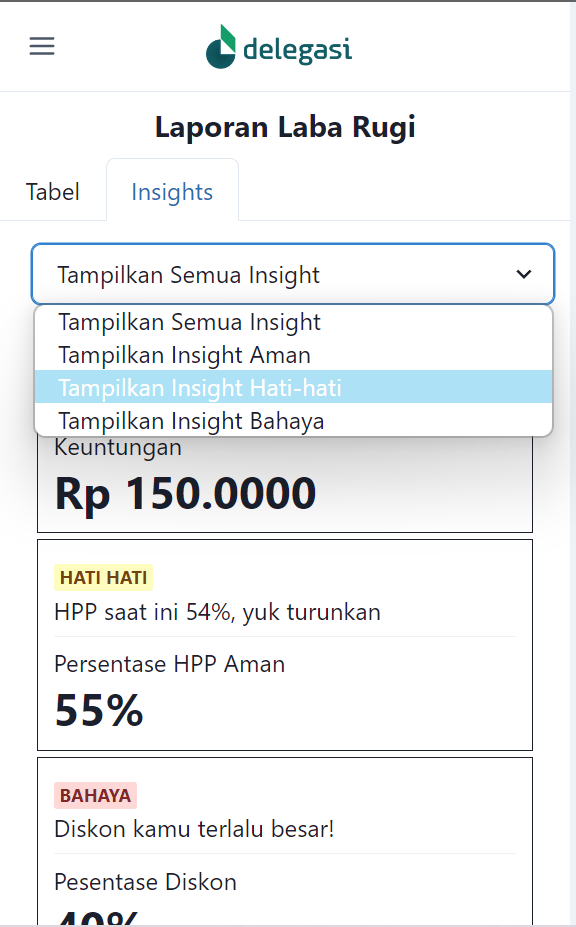

# Beranda

Pada `Beranda`, ini hanya page bridging untuk ke `Laporan Neraca` dan `Laporan Laba Rugi`

---

# Laporan Neraca & Laporan Laba Rugi

Pada `Laporan Neraca` dan `Laporan Laba Rugi` ini saya membuat 2 page yang ditaruh pada tabs.

Problem:

- user tidak punya keahlian pada accounting
- user ingin tahu hal yang penting dari laporan tersebut

Solusi:

- Info Detail Section: Tabel Section. Ini adalah source of truth.
- Info Penting Section: Insights Section. Pada page tersebut, user mendapatkan insight atau interpretasi dari tabel, dari insight tersebut diharapkan user dapat tahu hal-hal yang penting dari laporan keuangan. User dapat memfilter insight.
- Tabel dan Insight section dirangkai dalam tab untuk mempersimpel tampilan.

Challenge:

- Menampilkan tabel pada tampilan mobile ada kesulitan sendiri, karena layarnya tidak lebar tapi harus menampilkan data secara lengkap.

---

# Images

### Beranda

### Laporan Neraca: Tabel

### Laporan Neraca: Insights

### Laporan Laba Rugi: Tabel

### Laporan Laba Rugi: Insights

